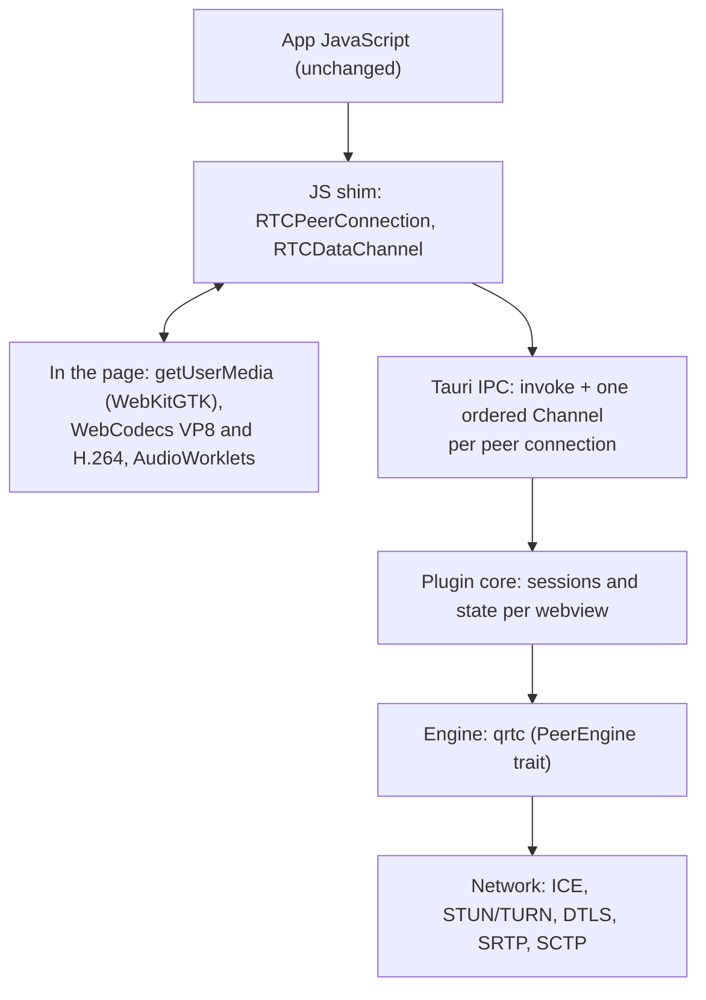

# tauri-plugin-webrtc

WebRTC for Tauri apps on Linux, without CEF. WebKitGTK ships no `RTCPeerConnection`
(2.52 and 2.54 tested). This plugin injects a standards-shaped JS shim, installed
only when the webview lacks native WebRTC. A pure Rust engine sits behind it: no
GStreamer WebRTC elements, no libwebrtc, no system packages beyond what WebKitGTK
already needs.

Documentation: <https://crabnebula-dev.github.io/tauri-plugin-webrtc/>, with
setup, the Web APIs the shim provides, post-quantum options, CSP behaviour,
the Tchap integration and the API reference.

The target is a Matrix client such as [Tchap](https://github.com/tchapgouv/tchap-desktop):
1:1 calls through matrix-js-sdk, and group calls through Element Call on LiveKit,
with end-to-end encryption.

## Use

```rust
tauri::Builder::default().plugin(tauri_plugin_webrtc::init())
```

Capability: `"webrtc:default"` (peer connections, data channels, media transport).
Camera, microphone and screen capture stay under the webview's own permission
handling.

The shim runs in every same-origin frame, so an embedded Element Call widget gets
WebRTC too. Cross-origin frames get nothing.

## Architecture on Linux



The shim is the only part the app sees. Capture, video encoding and decoding,
and playback stay in the page, so camera and microphone permissions remain the
webview's. Video crosses IPC only encoded; audio crosses as PCM, because the
engine runs echo cancellation, Opus and the playout clock. The plugin core keeps
each webview's peer connections and tears them down when the page navigates or
closes.

## What is covered

| Area | Status |
| --- | --- |
| `RTCPeerConnection` JSEP | Offers, answers, renegotiation, implicit and explicit rollback (perfect negotiation), re-offers of an unchanged session, `restartIce()` |
| ICE | Host, mDNS `.local` resolution, STUN, TURN over UDP, TCP and TLS (`turn:`, `turns:`, `?transport=`; long-term credentials, channels), relay-only policy |
| Data channels | Reliable and unreliable, ordered and unordered, negotiated ids, `bufferedAmount` and low-threshold events |
| Transceivers | W3C `addTrack` reuse, `removeTrack`, `addTransceiver`, directions, `currentDirection`, `replaceTrack`, `setCodecPreferences`, msid stream ids |
| Audio | Opus, echo cancellation (AEC3), noise suppression and AGC in the engine, one playout clock for all receivers, adaptive jitter buffer, in-band FEC |
| Video | VP8 and H.264 (when WebCodecs can encode it) both ways via WebCodecs in the page, keyframe requests, bandwidth estimate drives bitrate and resolution, screen-share profile (1080p, 15 fps) |
| Simulcast | Send side sends one layer, the best active encoding |
| DTMF | `RTCDTMFSender`: `insertDTMF`, `toneBuffer`, `tonechange`, sent as RFC 4733 telephone events |
| Encoded transforms | `RTCRtpScriptTransform` (LiveKit E2EE), audio and video, send and receive |
| Stats | `getStats()` with candidate pairs and candidates from the engine, `inbound-rtp` and `outbound-rtp` from the shim; the transport reports `tlsGroup` for post-quantum DTLS |
| Post-quantum | X25519MLKEM768 for DTLS 1.3 and TURN over TLS, on by default (see below) |
| Not yet | VP9 and AV1, receive-side simulcast layers |

### How media flows

- Video: the page captures frames from a hidden `<video>`, encodes VP8 with
  WebCodecs and hands encoded frames to the engine. Received frames are decoded
  with WebCodecs and drawn into a canvas whose `captureStream()` is the remote track.
- Audio: AudioWorklets move raw PCM between the page and the engine. The engine
  runs the audio processing, Opus and the playout clock.
- All engine traffic for one peer connection uses one ordered Tauri channel.

### Post-quantum key agreement

Hybrid post-quantum key agreement comes from one of two Cargo features. Both are
pure Rust and differ only in the ML-KEM implementation:

- `pq-moduletto` (default): [moduletto](https://github.com/crabnebula-dev/moduletto),
  which also adds ML-KEM-512 groups for engine-to-engine use;
- `pq-hybrid`: RustCrypto [ml-kem](https://crates.io/crates/ml-kem)
  (`default-features = false, features = ["pq-hybrid", …]`).

A connection opts in with the non-W3C `postQuantum` member of its configuration:

```js
new RTCPeerConnection({ iceServers, postQuantum: 'prefer' }); // 'off' | 'prefer' | 'require'
```

| Policy | DTLS (media and data channels) | TURN over TLS |
| --- | --- | --- |
| `off` | DTLS 1.2, classical groups | classical groups |
| `prefer` (default) | DTLS 1.3 with X25519MLKEM768 when the peer supports it, otherwise DTLS 1.2 | X25519MLKEM768 first, classical groups after |
| `require` | DTLS 1.3 with post-quantum groups only; other peers fail to connect | TLS 1.3 with post-quantum groups only |

Browsers do not negotiate post-quantum DTLS by default yet. Chromium 141 with its
`WebRTC-ForceDtls13` and `WebRTC-EnableDtlsPqc` field trials negotiates
X25519MLKEM768 with the engine; without them it falls back to DTLS 1.2 under
`prefer`. OpenSSL 3.5 servers (coturn built against it, for example) negotiate
X25519MLKEM768 for TURN over TLS.

Only the key exchange is post-quantum. Peers still authenticate with ECDSA
certificates whose fingerprints travel in the signalling.

### Content Security Policy

The AudioWorklet and the worker polyfill load from `blob:` URLs. Under a CSP
without `blob:` in `script-src` (Tchap's main window, for one):

- audio switches to `ScriptProcessorNode`s with the same logic;
- workers are not wrapped and `RTCRtpScriptTransform` is withdrawn, so encoded
  transforms are unavailable in that document. Element Call's own iframe has no
  such CSP and keeps E2EE.

## Engine

The engine is [qrtc](https://github.com/crabnebula-dev/qrtc), a separate
crate: sans-I/O WebRTC from [str0m](https://github.com/algesten/str0m) driven
by tokio, with pure Rust Opus ([rusty-opus](https://crates.io/crates/rusty-opus)),
audio processing ([sonora](https://crates.io/crates/sonora)), its own
STUN/TURN client, mDNS resolver and JSEP layer, and the post-quantum key
agreement described above. Its README covers the vendored str0m and DTLS
patches. The plugin's features forward to qrtc's.

TURN over TLS uses rustls with a selectable provider: `turn-tls-ring` (default;
ring compiles C and assembly) or `turn-tls-rustcrypto` (pure Rust,
pre-release). With neither, `turns:` servers are skipped. Certificates are
checked against the platform trust store, with Mozilla's roots as the fallback.

`sbom/` holds the CycloneDX SBOM of the plugin, regenerated whenever
`Cargo.lock` changes:

```sh
cargo cyclonedx --manifest-path plugin/Cargo.toml --spec-version 1.5 \
  --format json --target x86_64-unknown-linux-gnu --override-filename tauri-plugin-webrtc
mv plugin/tauri-plugin-webrtc.json sbom/tauri-plugin-webrtc.cdx.json
```

`deny.toml` configures cargo-deny (advisories, licences, bans, sources); CI
runs it on every push and weekly.

## Layout

- `plugin`: Tauri plugin, commands, and `guest-js/shim.js`.
- `examples/e2e-app`: Tauri app used by the end-to-end tests.
- `tests`: Node harnesses (Playwright with Chromium as the other peer).
- `sbom`: CycloneDX SBOMs.

## Test

```sh
# Engine tests run in qrtc. The TURN and engine-to-Chromium harnesses use its
# stdio_peer example, from a qrtc checkout next to this one (or QRTC_STDIO_PEER):
(cd ../qrtc && cargo build --example stdio_peer)
cd tests && npm install
node matrix/build.mjs                             # bundles matrix-js-sdk for the Matrix test
mkdir -p ../examples/e2e-app/dist/lk && cp node_modules/livekit-client/dist/livekit-client.{umd.js,e2ee.worker.mjs} ../examples/e2e-app/dist/lk/
cargo build --release -p e2e-app
APP=../target/release/e2e-app
node shim-e2e.mjs --app $APP                      # p2p: data, video, audio, both roles
node shim-e2e.mjs --app $APP --page index-csp.html  # same, under Tchap's CSP
node livekit-e2e.mjs --app $APP [--iframe]        # LiveKit room, plain and E2EE (LIVEKIT_SERVER)
node matrix-e2e.mjs --app $APP                    # matrix-js-sdk 1:1 calls (SYNAPSE_PY)
node h264-e2e.mjs --app $APP                      # H.264 between two WebKit instances
node turn-e2e.mjs                                 # TURN over UDP, TCP and TLS (coturn, openssl)
```

The harnesses also drive a Tchap build that carries the test hook: point `--app`
at it, and add `--tchap` for the LiveKit and Matrix tests.

The LiveKit test needs a `livekit-server` binary. The Matrix test runs Synapse as
a fixture; `SYNAPSE_PY` points at a Python with `matrix-synapse` installed.

On macOS the same suites run against WKWebView with the shim forced over its
native WebRTC. Build the e2e app as above, then set `E2E_FORCE_SHIM=1` and point
`CHROMIUM` at Google Chrome, which has H.264:

```sh
E2E_FORCE_SHIM=1 CHROMIUM="/Applications/Google Chrome.app/Contents/MacOS/Google Chrome" node shim-e2e.mjs --app $APP
```

The harnesses launch the app directly outside Linux, so no Xvfb is needed. This
checks the shim, the engine and the browser interop, not WebKitGTK.

## Licence and compliance

Licensed under either of Apache License 2.0 ([LICENSE-APACHE](LICENSE-APACHE))
or MIT ([LICENSE-MIT](LICENSE-MIT)), at your option.

CrabNebula stewards tauri-plugin-webrtc as free and open-source software. See
[COMPLIANCE.md](COMPLIANCE.md) for its status under the Cyber Resilience Act.
The engine, [qrtc](https://github.com/crabnebula-dev/qrtc), has its own statement.
